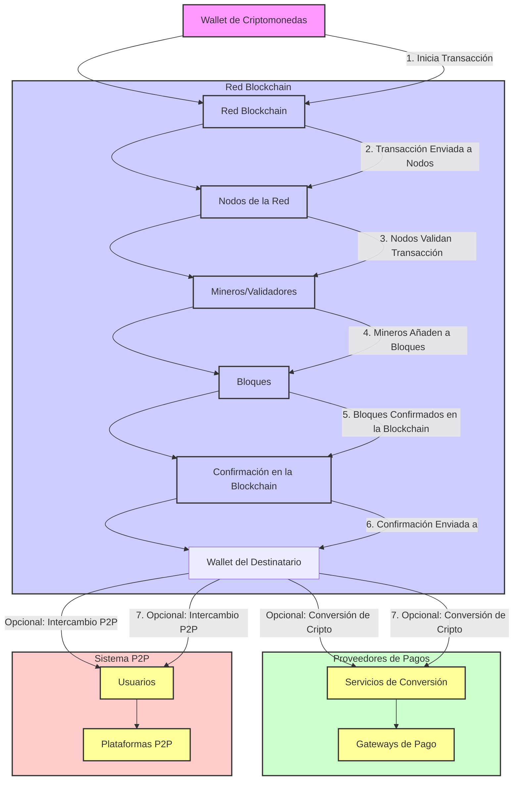

```mermaid
flowchart TB
    %% Nodo Principal
    A[Wallet de Criptomonedas] --> B[Red Blockchain]

    %% Subproceso de la Red Blockchain
    subgraph Blockchain [Red Blockchain]
        B --> C[Nodos de la Red]
        C --> D[Mineros/Validadores]
        D --> E[Bloques]
        E --> F[Confirmación en la Blockchain]
        F --> G[Wallet del Destinatario]
    end

    %% Proveedores de Pagos
    subgraph Pagos [Proveedores de Pagos]
        H[Servicios de Conversión] --> I[Gateways de Pago]
    end

    %% Sistema P2P
    subgraph P2P [Sistema P2P]
        J[Usuarios] --> K[Plataformas P2P]
    end

    %% Interacciones Opcionales
    G -->|Opcional: Conversión de Cripto| H
    G -->|Opcional: Intercambio P2P| J

    %% Descripción de los Pasos
    classDef main fill:#f9f,stroke:#333,stroke-width:2px;
    class A,B main;

    classDef blockchain fill:#ccf,stroke:#333,stroke-width:2px;
    class Blockchain blockchain;

    classDef pagos fill:#cfc,stroke:#333,stroke-width:2px;
    class Pagos pagos;

    classDef p2p fill:#fcc,stroke:#333,stroke-width:2px;
    class P2P p2p;

    classDef opcional fill:#ff9,stroke:#333,stroke-width:2px;
    class H,I,J,K opcional;

    %% Descripción de las relaciones
    A:::main -->|1. Inicia Transacción| B
    B:::blockchain -->|2. Transacción Enviada a Nodos| C
    C:::blockchain -->|3. Nodos Validan Transacción| D
    D:::blockchain -->|4. Mineros Añaden a Bloques| E
    E:::blockchain -->|5. Bloques Confirmados en la Blockchain| F
    F:::blockchain -->|6. Confirmación Enviada a| G

    G -->|7. Opcional: Conversión de Cripto| H
    G -->|7. Opcional: Intercambio P2P| J
```
